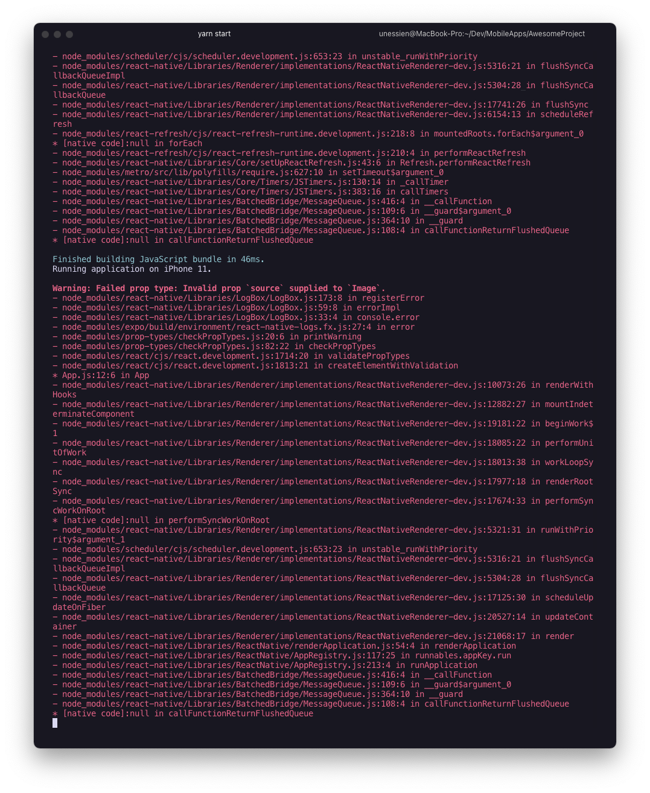

My initial attempt to start up a react native project failed. I cannot begin to tell you how frustrating this was for me. 

I started by watching a video from Traversy media's youtube video on react native. My initial approach was to look at a youtube [video](https://youtu.be/Hf4MJH0jDb4). Traversy is a fav of mine because he seem as unprofessional as I am and is also humble in the way he goes about things. Because of this, it is easy for me to relate to him and therefore learn. 

However, following his 2020 crash course in react-native lead to pain and anguish. The course uses `react-native-cli` which seems like the original CLI to be used in line with react-native development. The problem is it did not work. The reason it didnt work was because of the ios side of things. I don't know if I'll ever find the solution as to why. I went everywhere— stackoverflow, google and even the github issues page. It looks like people were facing a similar issue but there was no reply that helped my cause

The positive side of this encounter was that it got me back into the feel of debugging. Something that I hadn't done in a while since I was focused on my course material for my master's program.

I should have gone to the react-native documentation starting out before going to look for some third party tutorial on how to start. I remember writing this somewhere on the web, you would imagine that I would follow my own advice. Anyways summary is that when starting out on a new piece of tooling or language or program, it is always better to start from the offical docs.
